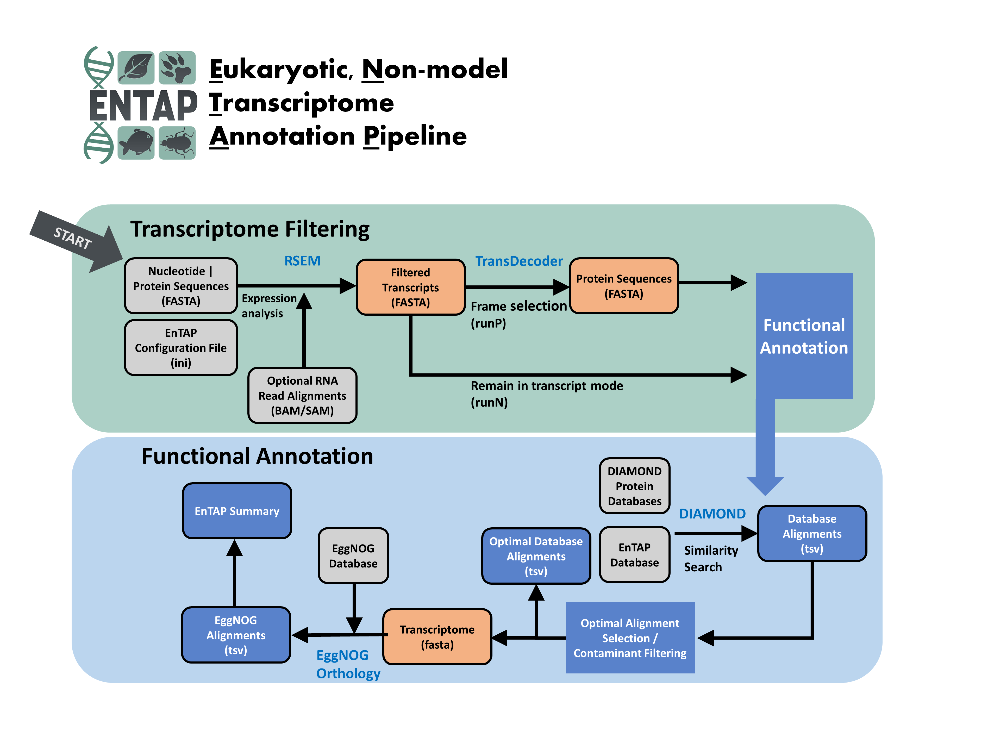

.. _rsem: https://github.com/deweylab/RSEM
.. _InterProScan: http://www.ebi.ac.uk/interpro/interproscan.html
.. _EggNOG-mapper: https://github.com/jhcepas/eggnog-mapper
.. _diamond: https://github.com/bbuchfink/diamond
.. _TCLAP: http://tclap.sourceforge.net/
.. _cereal: https://uscilab.github.io/cereal/
.. _TransDecoder: https://github.com/TransDecoder/TransDecoder/releases

Introduction
==================

The Eukaryotic Non-Model Transcriptome Annotation Pipeline (*EnTAP*) is designed to improve the accuracy, speed, and flexibility of functional gene annotation for de novo assembled transcriptomes in non-model eukaryotes. 

This software package addresses the fragmentation and related assembly issues that result in inflated transcript estimates and poor annotation rates.  Filtering is applied through assessment of true expression and frame selection, followed by leveraging open-source tools to functionally annotate the translated proteins. 

Downstream features include fast similarity search across multiple databases, protein domain assignment, orthologous gene family assessment, Gene Ontology term assignment, and KEGG pathway annotation.  

The final annotation integrates across multiple databases and selects an optimal assignment from a combination of weighted metrics describing similarity search score, taxonomic relationship, and informativeness.  Researchers have the option to include additional filters to identify and remove potential contaminants and prepare the transcripts for enrichment analysis.  This fully featured pipeline is easy to install, configure, and runs much faster than comparable functional annotation packages.  It is developed to contend with many of the issues in existing software solutions.  

Pipeline Stages
----------------------------
    * Transcriptome Filtering: designed to remove assembly artifacts and identify true CDS (complete and partial genes)
        1. Expression Filtering (RSEM)
        2. Frame Selection (TransDecoder)

    * Transcriptome Annotation: designed to assign functional information to sequences (homology, Gene Ontology, KEGG)
        3. Similarity Search: optimized search against user-selected databases (DIAMOND).  
        4. Contaminant Filtering and Best Hit Selection: selects final annotation and identifies potential contaminants
        5. Orthologous Group Assignment: independent assignment of translated protein sequences to gene families (eggNOG/eggnog-mapper).  Includes protein  domains (SMART/Pfam), Gene Ontology (GO) terms, and KEGG pathway assignment.
        6. InterProScan (optional): sequence search against the families of InterPro databases to assign protein domains, Gene Ontology terms, and pathway information

How to cite:
    * Hart AJ, Ginzburg S, Xu M, et al. EnTAP: Bringing faster and smarter functional annotation to non-model eukaryotic transcriptomes. Mol Ecol Resour. 2020;20:591–604. https://doi.org/10.1111/1755-0998.13106

Citations
-------------
[1]   A. Mitchell, H.-Y. Chang, and L. Daugherty, "The InterPro protein families database: the
      classification resource after 15 years," Nucleid Acids Research, vol. 43, no. D1, 2015.

[2]   B. Buchfink, Xie C., D. Huson, "Fast and sensitive protein alignment using 
      DIAMOND", Nature Methods 12, 59-60 (2015).

[3]   eggNOG 4.5: a hierarchical orthology framework with improved functional 
      annotations for eukaryotic, prokaryotic and viral sequences. Jaime
      Huerta-Cepas, Damian Szklarczyk, Kristoffer Forslund, Helen Cook, Davide
      Heller, Mathias C. Walter, Thomas Rattei, Daniel R. Mende, Shinichi
      Sunagawa, Michael Kuhn, Lars Juhl Jensen, Christian von Mering, and Peer
      Bork. Nucl. Acids Res. (04 January 2016) 44 (D1): D286-D293. doi:
      10.1093/nar/gkv1248
	  
[4]   eggNOG 5.0: a hierarchical, functionally and phylogenetically annotated
      orthology resource based on 5090 organisms and 2502 viruses. Jaime
      Huerta-Cepas, Damian Szklarczyk, Davide Heller, Ana Hernández-Plaza, Sofia
      K Forslund, Helen Cook, Daniel R Mende, Ivica Letunic, Thomas Rattei, Lars
      J Jensen, Christian von Mering, Peer Bork Nucleic Acids Res. 2019 Jan 8;
      47(Database issue): D309–D314. doi: 10.1093/nar/gky1085 
	  
[5]   eggNOG-mapper v2: functional annotation, orthology assignments, and domain 
      prediction at the metagenomic scale. Carlos P. Cantalapiedra, 
      Ana Hernandez-Plaza, Ivica Letunic, Peer Bork, Jaime Huerta-Cepas. 2021.
      Molecular Biology and Evolution, msab293, https://doi.org/10.1093/molbev/msab293

[6]   G. O. Consortium, "Gene Ontology Consortium: going forward," (in eng), Nucleic Acids Res,
      vol. 43, no. Database issue, pp. D1049-56, Jan 2015. 

[7]   J. Huerta-Cepas et al., "Fast genome-wide functional annotation through orthology 
      assignment by eggNOG-mapper," (in eng), Mol Biol Evol, Apr 2017.

[8]   M. Kanehisa, M. Furumichi, M. Tanabe, Y. Sato, and K. Morishima, "KEGG: 
      new perspectives on genomes, pathways, diseases and 
      drugs," (in eng), Nucleic Acids Res, vol. 45, no. D1, pp. D353-D361, Jan 2017
   
[9]   B. Li and C. N. Dewey, "RSEM: accurate transcript quantification from 
      RNA-Seq data with or without a reference genome," (in eng), 
      BMC Bioinformatics, vol. 12, p. 323, Aug 2011. 

[10]  P. Jones et al., "InterProScan 5: genome-scale protein function classification," (in eng),
      Bioinformatics, vol. 30, no. 9, pp. 1236-40, May 2014.

[11]   S. Tang, A. Lomsadze, and M. Borodovsky, "Identification of protein coding regions in
      RNA transcripts," Nucleic Acids Research, 2015

[12]  https://github.com/TransDecoder/TransDecoder/releases

Software contained or used within this pipeline:
-------------------------------------------------------
* `RSEM`_
* `DIAMOND`_
* `EggNOG`_
* `TransDecoder`_
* `InterProScan`_
* `TCLAP`_
* `cereal`_
* `EggNOG-mapper`_