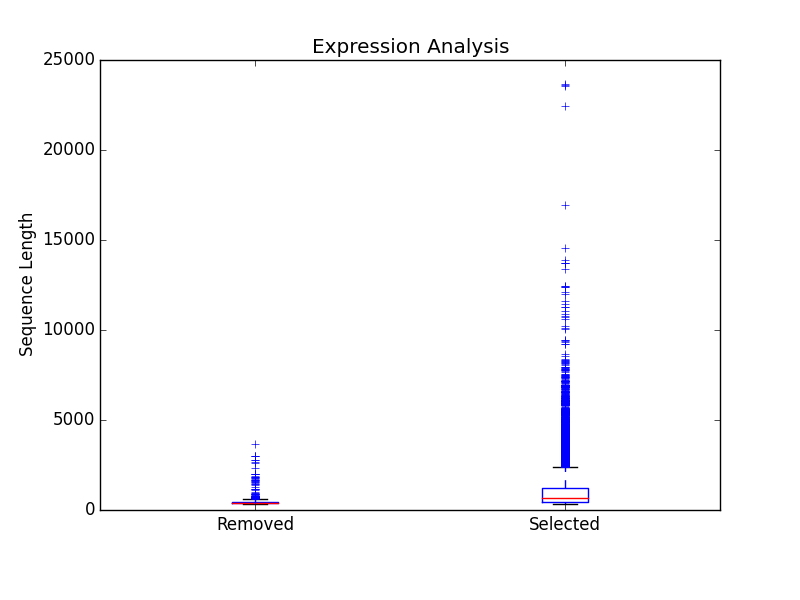

.. |exp_dir| replace:: */expression*
.. |exp_proc_dir| replace:: */processed*
.. |exp_fig_dir| replace:: */figures*

Expression Analysis
=============================
The goal of expression filtering, or transcript quantification, is to determine the relative 
abundance levels of transcripts when taking into account the sequenced reads and how they map 
back to the assembled transcriptome and using this information to filter out suspect expression 
profiles possibly originated from poor or incomplete assemblies. Filtering is done through the use
of the FPKM (fragments per kilobase per of million mapped reads) , or a measurable number of 
expression. This can be specified with the - -fpkm flag as specified above. EnTAP will use this FPKM value
and remove any sequences that are below the threshold.

Interpreting the Results
-----------------------------
The |exp_dir| folder will contain all of the relevant information for this stage of the pipeline. This folder will contain the :ref:`main files<exp_main-label>` (results from expression analysis software), files :ref:`processed<exp_proc-label>` from EnTAP (including graphs). 

.. exp_main-label:

RSEM Files: |exp_dir|
^^^^^^^^^^^^^^^^^^^^^^^
The |exp_dir| directory will contain all of the output from RSEM including a converted BAM file (if you input a SAM) and the results of the expression analysis. 

.. exp_proc-label:

EnTAP Files: |exp_proc_dir|
^^^^^^^^^^^^^^^^^^^^^^^^^^^^^
This directory will contain all of the files produced from EnTAP concerning expression analysis. With a generic transcriptome input of "Species.fasta", these files will have the following format

* Species_removed.fasta

    * Fasta file of sequences that were under the specified FPKM threshold

* Species_kept.fasta

    * Fasta file of sequences that were kept after filtering (over the FPKM threshold)

* |exp_fig_dir|

    * Directory containing a box plot of sequence length vs the sequences that were removed and kept after expression analysis

