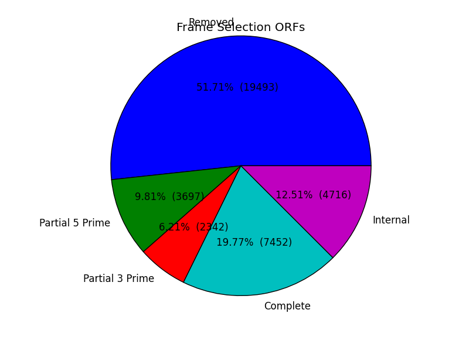
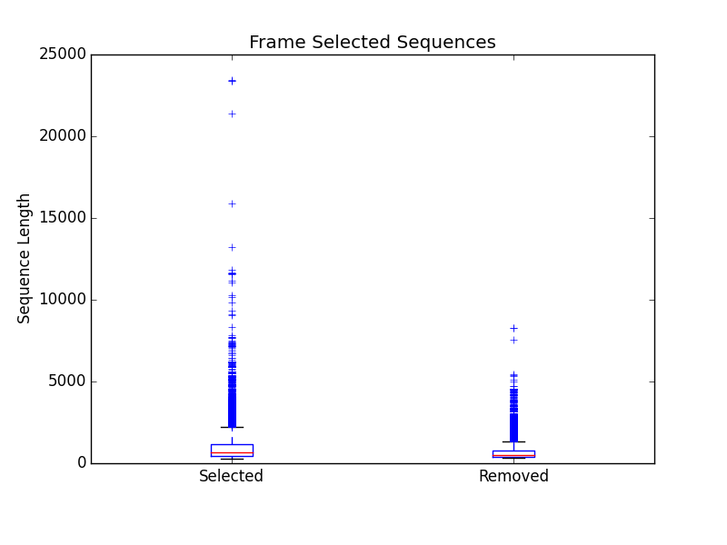

.. |frame_dir| replace:: */frame_selection*
.. |frame_proc_dir| replace:: */processed*
.. |frame_fig_dir| replace:: */figures*
.. _TransDecoder: https://github.com/TransDecoder/TransDecoder/wiki

Frame Selection
=============================
Frame selection is the process of determining the coding region of a transcript. Oftentimes, due to 
assembly errors or other factors, a coding region may not be found for a transcript and EnTAP will remove
this sequence. When a coding region is found, EnTAP will include the sequence for further annotation.

Interpreting the Results
-------------------------------
The |frame_dir| folder will contain all of the relevant information for the frame selection stage of the pipeline. This folder will contain results from frame selection software, files :ref:`processed<f_proc-label>` from EnTAP, and :ref:`figures<f_fig-label>` generated from EnTAP.

.. _f_trans-main-label:

TransDecoder Files: |frame_dir|
^^^^^^^^^^^^^^^^^^^^^^^^^^^^^^^^^^^
The files within the root |frame_dir| directory contain the results from the frame selection portion of the pipeline. More information can be found at TransDecoder_ (the descriptions below are taken from there):

* transcripts.fasta.transdecoder.pep

    * Peptide sequences for the final candidate ORFs; all shorter candidates within longer ORFs were removed.

* transcripts.fasta.transdecoder.gff3

    * Positions within the target transcripts of the final selected ORFs

* transcripts.fasta.transdecoder.cds

    * Nucleotide sequences for coding regions of the final candidate ORFs

* .err and .out file

    * These files are will contain any error or general information produced from the TransDecoder run

.. _f_proc-label:

EnTAP Files: |frame_proc_dir|
^^^^^^^^^^^^^^^^^^^^^^^^^^^^^^^^^^^^^
Files within the |frame_proc_dir| are generated by EnTAP and will contain ORF information based on the  TransDecoder execution. Using TransDecoder as an example:

* transdecoder_complete_genes.fasta

    * Amino acid sequences of complete genes from transcriptome

* transdecoder_partial_genes.fasta

    * Amino acid sequences of partial (5' and 3') sequences

* transdecoder_internal_genes.fasta

    * Amino acid sequences of internal sequences

* transdecoder_sequences_lost.fasta

    * Nucleotide sequences in which a frame was not found. These will not continue to the next stages of the pipeline

.. _f_fig-label:

EnTAP Files: |frame_fig_dir|
^^^^^^^^^^^^^^^^^^^^^^^^^^^^
In addition to files, EnTAP will generate figures within the |frame_fig_dir| directory. These are some useful visualizations of the information provided by TransDecoder.

* frame_results_pie.png

    * Pie chart representing the transcriptome (post expression filtering) showing complete/internal/partial/and sequences in which a frame was not found

* frame_selected_seq.png

    * Box plot of sequence length vs. the sequences that were lost during frame selection and the sequences in which a frame was found

