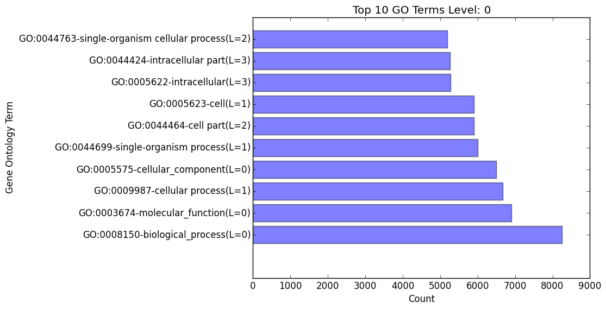
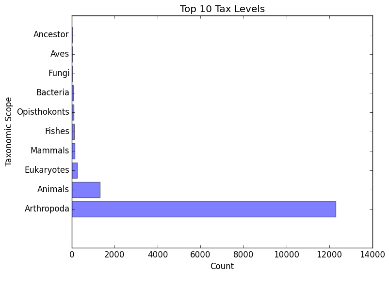

.. |egg_dir| replace:: */ontology/EggNOG*
.. |egg_fig_dir| replace:: */figures*
.. |egg_proc_dir| replace:: */processed*
.. |inter_dir| replace:: */ontology/InterProScan*
.. |inter_proc_dir| replace:: */processed*
.. _EggNOG: https://github.com/jhcepas/eggnog-mapper
.. _InterProScan: https://www.ebi.ac.uk/interpro/

Gene Family / Ontology Analysis
====================================

Interpreting the Results - EggNOG
-------------------------------------
The |egg_dir| directory will contain all of the relevant information for the EggNOG stage of the pipeline. This folder will contain the :ref:`EggNOG files<egg_main-label>`, :ref:`files<egg_proc-label>` analyzing the annotation from EggNOG, and :ref:`figures<egg_fig-label>` generated from EnTAP.

.. _egg_main-label:

EggNOG Files: |egg_dir|
^^^^^^^^^^^^^^^^^^^^^^^^^^^
Files within the |egg_dir| are generated through DIAMOND alignment against the EggNOG orthologous database and will contain information based on the hits returned. More information can be found at EggNOG_. 

* blastp_transcriptome_eggnog_proteins.out

    * EggNOG results for sequences from the final transcriptome being used (post-processing)

.. _egg_proc-label:

EnTAP Files: |egg_proc_dir|
^^^^^^^^^^^^^^^^^^^^^^^^^^^^^
Files within the |egg_proc_dir| are generated by EnTAP and contain information on what sequences were annotated and which were not. 

* eggnog_unannotated.fnn/faa

    * Sequences where no gene family could be assigned (nucleotide/protein)

* eggnog_annotated.fnn/faa

    * Sequences where a gene family could be assigned (nucleotide/protein)

.. _egg_fig-label:

EnTAP Files: |egg_fig_dir|
^^^^^^^^^^^^^^^^^^^^^^^^^^^^
The |egg_fig_dir| will contain figures generated by EnTAP of Gene Ontology and Taxonomic distribution of the results

* (overall/molecular_function/cellular_component/biological_process)#_go_bar_graph.png/.txt

    * Bar graph of each category of Gene Ontology terms

* eggnog_tax_scope.png/.txt

    * A bar graph representation of the taxonomic scope of the gene families assigned through EggNOG

Interpreting the Results - InterProScan
-------------------------------------------
The |inter_dir| directory will contain all of the relevant information for the optional InterProScan stage of the pipeline. This folder will contain the :ref:`InterProScan files<inter_main-label>` and :ref:`files<inter_proc-label>` generated from EnTAP analyzing the annotation from InterProScan.

.. _inter_main-label:

InterProScan Files: |inter_dir|
^^^^^^^^^^^^^^^^^^^^^^^^^^^^^^^^^^^
Files within the |inter_dir| are generated through InterProScan and will contain information based on the results from the InterPro databases. More information can be found at InterProScan_. 

* interproscan.tsv/xml

    * Tab delimited or XML file containing information on the sequences with domain matches. Information such as signature accession/description information and GO/Pathway alignments.

.. _inter_proc-label:

EnTAP Files: |inter_proc_dir|
^^^^^^^^^^^^^^^^^^^^^^^^^^^^^^^^^^
Files within the |inter_proc_dir| are generated by EnTAP and contain information on what sequences had domain matches, and which did not. 

* unannotated_sequences.fnn/faa

    * Sequences where no domain could be assigned (nucleotide/protein)

* annotated_sequences.fnn/faa

    * Sequences where a no domain could be assigned (nucleotide/protein)

