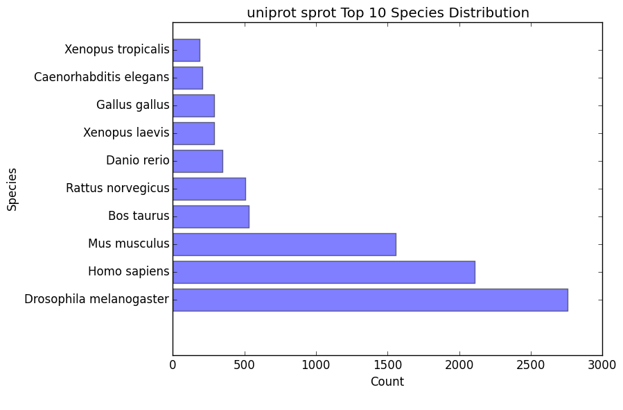
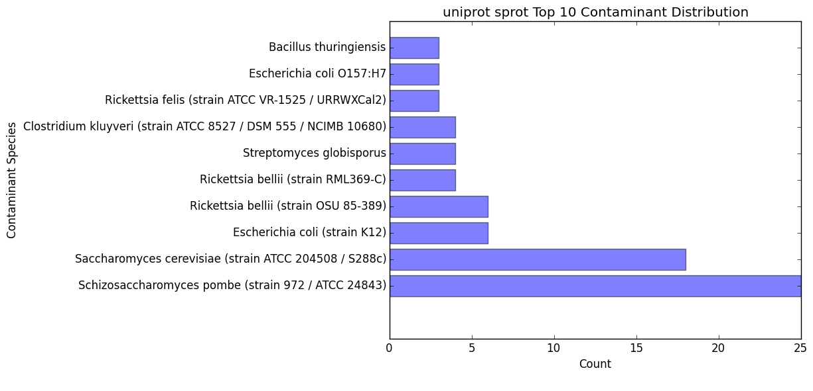

.. |sim_dir| replace:: */similarity_search*
.. |sim_proc_dir| replace:: */processed*
.. |sim_fig_dir| replace:: */figures*
.. |sim_res_dir| replace:: */overall_results*
.. _DIAMOND: https://github.com/bbuchfink/diamond

Similarity Searching
=========================

Taxonomic Favoring and Contaminant Filtering
--------------------------------------------------
Taxonomic contaminant filtering (as well as taxonomic favoring) is based upon the `NCBI Taxonomy`_ database. In saying this, all species/genus/lineage names must be contained within this database in order for it to be recognized by EnTAP. 

**Contaminant Filtering:**

Contaminants can be introduced during collection or processing of a sample. A contaminant is essentially a species that is not of the target species you are collecting. Some common contaminants are bacteria and fungi that can sometimes be found within collected samples. Transcripts flagged as contaminants will be written to a file appended with "_contam", but not removed from the final annotations file. Oftentimes, researchers would like to remove these sequences from the dataset. 

One or more contaminants can be specified in the ini file (separated by a comma). An example of flagging bacteria and fungi as contaminants can be seen below:

.. code-block:: bash

    contam=fungi,bacteria

Some common contaminants:
* insecta
* fungi
* bacteria

**Taxonomic Favoring**

During best hit selection of similarity searched results, taxonomic consideration can utilized. If a certain lineage (pinus) is specified, hits closer in taxonomic lineage to this selection will be chosen. Any lineage such as species/kingdom/phylum can be utilized as long as it is contained within the Taxonomic Database. If it is not located within the database, EnTAP will stop the execution immediately and let you know! 

This feature can be utilized via the ini file. An example can be seen below (Note: replace any spaces with an underscore):

.. code-block:: bash

    taxon=pinus_taeda

Another example could be:

.. code-block:: bash
    
    taxon=pinus

Keep in mind, EnTAP will weigh the E-Value (within a database)and Coverage of the alignment before taxonomic weight in order to provide the most accurate result. If both the E-Value and Coverage are relatively similar, EnTAP will leverage taxonomic information.

Interpreting the Results
-------------------------------
The |sim_dir| directory will contain all of the relevant information for the similarity searching stage of the pipeline. This folder will contain the :ref:`main files<sim_main-label>` (results from similarity search software), :ref:`files<sim_proc-label>` analyzing hits from each database, :ref:`overall<sim_res-label>` results combining the information from each database, and :ref:`figures<sim_fig-label>` generated from EnTAP.

.. _sim_main-label:

DIAMOND Files: |sim_dir|
^^^^^^^^^^^^^^^^^^^^^^^^^^^^^^
The files within the |sim_dir| directory contain the results from the similarity searching portion of the pipeline against each database you select. More information can be found at DIAMOND_. With running _blastp (protein similarity searching), a generic transcriptome input of "Species.fasta", with a database called "database" the files will have the following format:

* blastp_Species_database.out

    * This contains the similarity search information provided in the format from DIAMOND
    * Header information (from left to right):

        * Query Sequence ID
        * Subject Sequence ID
        * Percentage of Identical Matches
        * Alignment Length
        * Number of Mismatches
        * Number of gap openings
        * Start of alignment in query
        * End of alignment in query
        * Start of alignment in subject
        * End of alignment in subject
        * Expect (e) value
        * Bit score
        * Query Coverage
        * Subject Title (pulled from database)
* blastp_Species_database_std.err and .out

    * These files are will contain any error or general information produced from DIAMOND

.. _sim_proc-label:

EnTAP Files: |sim_proc_dir|
^^^^^^^^^^^^^^^^^^^^^^^^^^^^^^^^
Files within the |sim_proc_dir| are generated by EnTAP and will contain information based on the hits returned from similarity searching against each database. This information contains the *best hits* (discussed previously) from each database based on e-value, coverage, informativeness, phylogenetic closeness, and contaminant status.

The files below represent a run with the same parameters as the section above:

* All the TSV files mentioned in this section will have the same header as follows (from left to right):

    * Query sequence ID
    * Subject sequence ID
    * Percentage of identical matches
    * Alignment length
    * Number of mismatches
    * Number of gap openings
    * Start of alignment in query
    * End of alignment in query
    * Start of alignment in subject
    * End of alignment in subject
    * Expect (e) value
    * Query coverage
    * Subject title
    * Species (pulled from hit)
    * Origin Database
    * ORF (taken from frame selection stage)
    * Contaminant (yes/no the hit was flagged as a contaminant)

* database/diamond_annotated.faa and .fnn and .tsv

    * Best hits (protein and nucleotide) that were selected from this database
    * This contains ALL best hits, including any contaminants that were found as well as uninformative hits. Sometimes a contaminant can be the highest quality alignment!
    * The .tsv file contains the header information mentioned above of these same sequences
    * Note: Protein or nucleotide information may not be available to report depending on your type of run (these files will be empty)

* database/diamond_annotated_contam.faa/.fnn/.tsv

    * Contaminants (protein/nucleotide) separated from the best hits file. As such, these contaminants will also be in the _best_hits.faa/.fnn.tsv files

* database/diamond_annotated_without_contam.faa/.fnn/.tsv

    * Sequences (protein/nucleotide) that were selected as best hits and not flagged as contaminants
    * With this in mind: best_hits = best_hits_no_contam + best_hits_contam
    * These sequences are separated from the rest for convenience if you would like to examine them differently

* database/unannotated.faa/.fnn/.tsv

    * Sequences (protein/nucleotide) from the transcriptome that did not hit against this particular database.
    * This does not include sequences that were lost during expression filtering or frame selection

* database/diamond_unselected_hits.tsv

    * Similarity searching can result in several hits for each query sequence. With only one best hit being selected, the rest are unselected and end up here
    * Unselected hits can be due to a low e-value, coverage, or other properties EnTAP takes into account when selecting hits

.. _sim_res-label:

EnTAP Files: |sim_res_dir|
^^^^^^^^^^^^^^^^^^^^^^^^^^^^
While the |sim_proc_dir| directory contains the best hit information from each database, the |sim_res_dir| directory contains the overall best hits combining the hits from each database.

.. _sim_fig-label:

EnTAP Files: |sim_fig_dir|
^^^^^^^^^^^^^^^^^^^^^^^^^^^^
In addition to files, EnTAP will generate figures within the |sim_fig_dir| directory for each database. These are some useful visualizations of the information provided by similarity searching.

Here, there will be several figures:

* species_bar.png / species_bar.txt

    * Bar graph representing the top 10 species that were hit within a database
    * Text file representing the data being displayed

* contam_bar.png / contam_bar.txt

    * Bar graph representing the top 10 contaminants (within best hits) that were hit against the databast
    * Text file representing the data being displayed

