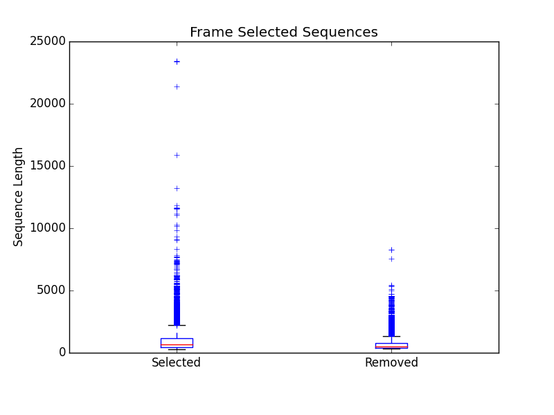
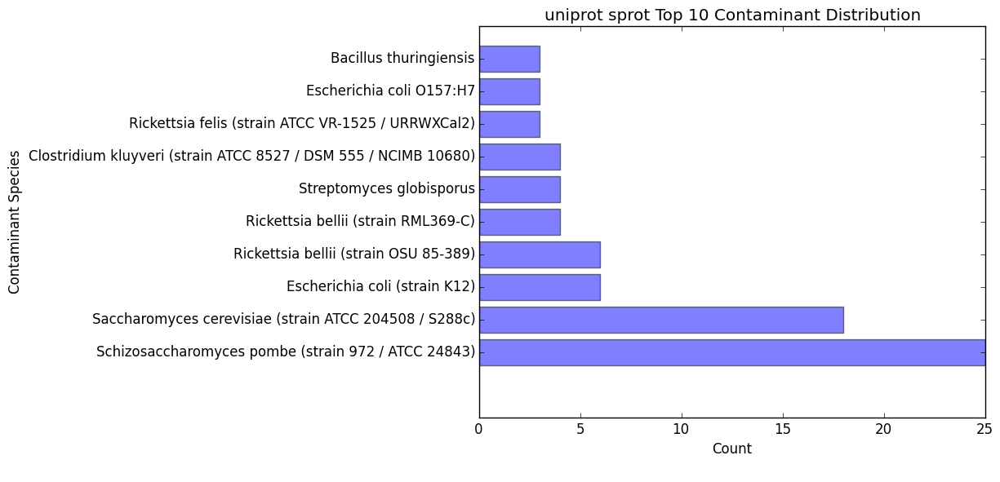

.. |exp_dir| replace:: */expression*
.. |exp_proc_dir| replace:: */processed*
.. |exp_fig_dir| replace:: */figures*
.. |frame_dir| replace:: */frame_selection*
.. |frame_proc_dir| replace:: */processed*
.. |frame_fig_dir| replace:: */figures*
.. |sim_dir| replace:: */similarity_search*
.. |sim_proc_dir| replace:: */processed*
.. |sim_fig_dir| replace:: */figures*
.. |sim_res_dir| replace:: */overall_results*
.. |egg_dir| replace:: */ontology/EggNOG*
.. |egg_fig_dir| replace:: */figures*
.. |egg_proc_dir| replace:: */processed*
.. |inter_dir| replace:: */ontology/InterProScan*
.. |inter_proc_dir| replace:: */processed*
.. |final_dir| replace:: */final_results*
.. |transc_dir| replace:: */transcriptomes*
.. _EggNOG: https://github.com/jhcepas/eggnog-mapper
.. _InterProScan: https://www.ebi.ac.uk/interpro/
.. _DIAMOND: https://github.com/bbuchfink/diamond
.. _TransDecoder: https://github.com/TransDecoder/TransDecoder/wiki
.. _GO: http://www.geneontology.org/

Interpreting the Results
=================================

*EnTAP* provides many output files at each stage of execution to better see how the data is being managed throughout the pipeline:

#. :ref:`Final Annotation Results<final-label>`
#. :ref:`Log File / Statistics<log-label>`
#. :ref:`Transcriptomes<transc-label>`
#. :ref:`Expression Filtering<exp-label>`
#. :ref:`Frame Selection<frame-label>`
#. :ref:`Similarity Searching<sim-label>`
#. :ref:`Orthologous Groups/Ontology<ont-label>`
#. :ref:`Protein Families<inter-label>` (optional)

The two files to check out first are the :ref:`final annotations<final-label>` and :ref:`log file<log-label>`. These files contain a summary of all the information collected at each stage, including statistical analyses. The remaining files are there for a more in depth look at each stage. All files will be contained in "entap_outfiles" directory as default, or different if the - - out-dir flag was specified.

.. _final-label:

Final Annotations
-----------------------

The final EnTAP annotations are contained within the |final_dir| directory. These files are the summation of each stage of the pipeline and contain the combined information. So these can be considered the most important files! The "full_entap.tsv" file will contain all of the information gathered throughout the pipeline summarized in one file. This will include annotated, unannotated, and contaminated sequences. 

All .tsv files in this section may have the following header information (from left to right) separated by each portion of the pipeline. Some headers will not be shown if that part of the pipeline was skipped or the information was not found for any of the input sequences. TSV formatted files support Tidyverse format (including 'NA' being used for empty data cells).

General Header Information
    * Query sequence ID

Frame Selection Header Information (optional)
    * Open Reading Frame

Expression Analysis Header Information (optional)
    * FPKM
    * TPM
    * Effective Length

Similarity Search Header Information
    * Subject sequence ID
    * Percentage of identical matches
    * Alignment length
    * Number of mismatches
    * Number of gap openings
    * Start of alignment in query
    * End of alignment in query
    * Start of alignment in subject
    * End of alignment in subject
    * Expect (e) value
    * Query coverage
    * Subject title
    * Species
    * Taxonomic Lineage
    * Origin Database
    * Contaminant (yes/no if the hit was flagged as a contaminant)
    * Informative (yes/no if he hit was flagged as informative)

Similarity Search UniProt Header Information (optional if aligning against SwissProt database)
    * UniProt Database Cross References
    * UniProt Additional Information
    * UniProt KEGG Terms
    * UniProt GO Biological
    * UniProt GO Cellular
    * UniProt GO Molecular

Ontology EggNOG Header Information
    * Seed Ortholog
    * Seed E-Value
    * Seed Score
    * Predicted Gene
    * Taxonomic Scope
    * OGs (orthologous groups assigned)
    * EggNOG Description (EggNOG)
    * KEGG Terms (EggNOG)
    * GO Biological (Gene Ontology)
    * GO Cellular (Gene Ontology)
    * GO Molecular (Gene Ontology)
    * BIGG Reaction

Ontology InterProScan Header Information
    * IPScan GO Biological 
    * IPScan GO Cellular
    * IPScan GO Molecular
    * Pathways
    * InterPro (InterPro database entry)
    * Protein Database (database assigned. Ex: pfam)
    * Protein Description (description of database entry)
    * E Value (E-value of hit against protein database)

    * full_entap.tsv

        * This .tsv file is essentially a final report from EnTAP that will have the headers as mentioned previously, summarizing the results of the entire pipeline
        * Since this includes every single transcript, there will be annotated, unannotated, and contaminated sequences. Further filtering of transcripts (for example if you are only interested in those transcripts that were annotated) can be done with this file or the below files

    * annotated.faa / .fnn / .tsv

        * Nucleotide/protein fasta files along with tsv file containing all sequences that either align databases through similarity searching or through the ontology stage

    * unannotated.faa / .fnn / .tsv

        * Nucleotide/protein fasta files along with tsv file containing all sequences that did not align either through similarity searching nor through the ontology stage

    * annotated_contam.faa / .fnn / .tsv

        * Nucleotide/protein fasta files along with tsv file containing all annotated sequences that were flagged as a contaminant

    * annotated_without_contam.faa / .fnn / .tsv

        * Nucleotide/protein fasta files along with tsv file containing all annotated sequences that were not flagged as a contaminant

    * x_enrich_geneid_go.tsv

        * Tab-deliminated file that can be used for Gene Enrichment
        * First column contains the gene ID and second column contains the Gene Ontology term corresponding to the gene ID

    * x_enrich_geneid_len.tsv

        * Tab-deliminated file that can be used for Gene Enrichment
        * First column contains the gene ID and second columns contains the effective length from Expression Analysis. This file will not be printed if Expression Analysis has not been ran
        * Note: the Length column will not be printed when Expression Filtering has not been performed

    * x_gene_ontology_terms.tsv

        * Tab-deliminated file that can be used for Gene Enrichment
        * Columns are as follows: Sequence ID, Gene Ontology Term ID, Gene Ontology Term, Gene Ontology Category, and Effective Length
        * Note: the Effective Length column will not be printed when Expression Filtering has not been performed
		

.. _log-label:

Log File / Statistics
-----------------------------

The log file contains a statistical analysis of each stage of the pipeline that you ran. I'll give a brief outline of some of the stats performed:

#. Initial Statistics

    * Transcriptome statistics: n50, n90, average gene length, longest/shortest gene
    * Summary of user flags
    * Summary of execution paths (from config file)

#. Expression analysis

    * Transcriptome statistics: n50, n90, average gene length, longest/shortest gene
    * Summary of sequences kept/removed after filtering

#. Frame Selection

    * Transcriptome statistics: n50, n90, average gene length, longest/shortest gene
    * Summary of frame selection: Partial, internal, complete genes. Genes where no frame was found

#. Similarity Searching

    * Contaminant/uninformative/informative count
    * Phylogenetic/contaminant distribution of alignments
    * Alignment distribution based upon frame results (partial/internal/complete)
    * Sequence count that did not align against a database reference
    * Statistics calculated for each individual database and final results

#. Gene Family Assignment

    * Phylogenetic distribution of gene family assignments
    * Gene Ontology category distribution (biological processes, molecular function, cellular component)

#. InterProScan

    * Additional statistics coming soon!

#. Final Annotation Statistics

    * Statistical summary of each stage
    * Runtime

.. _transc-label:

Transcriptomes
---------------------
The |transc_dir| contains the original, processed, and final transcriptomes being used by EnTAP. The files are as follows with the 'transcriptome' tag based upon the name of your input transcriptome:

* transcriptome.fasta

    * This file is essentially a copy of your input transcriptome. The sequence ID's may be changed depending on whether you selected the 'trim' flag or otherwise.

* transcriptome_expression_filtered.fasta

    * As the name implies, this transcriptome is the resultant of the Expression Filtering stage with sequences removed that fall under the FPKM threshold you have specified.

* transcriptome_frame_selected.fasta

    * This transcriptome is the resultant of Frame Selection. Sequences in which a frame was not selected are removed and those with a frame are kept in this file. As a result, this file will always be in protein format. 

* transcriptome_final.fasta

    * This is your final transcriptome following the "Transcriptome Filtering" stage of EnTAP. **This transcriptome will be used for the later stages of the pipeline** (Similarity Searching and Ontology). Depending on which methods of execution you chose (runN / runP), the result here may be either protein or nucleotide with Frame Selection and/or Expression Filtering.

.. _exp-label:

Expression Filtering (RSEM)
---------------------------------
The |exp_dir| folder will contain all of the relevant information for this stage of the pipeline. This folder will contain the :ref:`main files<exp_main-label>` (results from expression analysis software), files :ref:`processed<exp_proc-label>` from EnTAP (including graphs). 

.. exp_main-label:

RSEM Files: |exp_dir|
^^^^^^^^^^^^^^^^^^^^^^^
The |exp_dir| directory will contain all of the output from RSEM including a converted BAM file (if you input a SAM) and the results of the expression analysis. 

.. exp_proc-label:

EnTAP Files: |exp_proc_dir|
^^^^^^^^^^^^^^^^^^^^^^^^^^^^^
This directory will contain all of the files produced from EnTAP concerning expression analysis. With a generic transcriptome input of "Species.fasta", these files will have the following format

* Species_removed.fasta

    * Fasta file of sequences that were under the specified FPKM threshold

* Species_kept.fasta

    * Fasta file of sequences that were kept after filtering (over the FPKM threshold)

* |exp_fig_dir|

    * Directory containing a box plot of sequence length vs the sequences that were removed and kept after expression analysis

.. image::    plot_exp_box.png
	:scale: 50%
	:align: center

.. _frame-label:

Frame Selection
-------------------------------------------------------
The |frame_dir| folder will contain all of the relevant information for the frame selection stage of the pipeline. This folder will contain results from frame selection software, files :ref:`processed<f_proc-label>` from EnTAP, and :ref:`figures<f_fig-label>` generated from EnTAP.

.. _f_trans-main-label:

TransDecoder Files: |frame_dir|
^^^^^^^^^^^^^^^^^^^^^^^^^^^^^^^^^^^
The files within the root |frame_dir| directory contain the results from the frame selection portion of the pipeline. More information can be found at TransDecoder_ (the descriptions below are taken from there):

* transcripts.fasta.transdecoder.pep

    * Peptide sequences for the final candidate ORFs; all shorter candidates within longer ORFs were removed.

* transcripts.fasta.transdecoder.gff3

    * Positions within the target transcripts of the final selected ORFs

* transcripts.fasta.transdecoder.cds

    * Nucleotide sequences for coding regions of the final candidate ORFs

* .err and .out file

    * These files are will contain any error or general information produced from the TransDecoder run

.. _f_proc-label:

EnTAP Files: |frame_proc_dir|
^^^^^^^^^^^^^^^^^^^^^^^^^^^^^^^^^^^^^
Files within the |frame_proc_dir| are generated by EnTAP and will contain ORF information based on the  TransDecoder execution. Using TransDecoder as an example:

* transdecoder_complete_genes.fasta

    * Amino acid sequences of complete genes from transcriptome

* transdecoder_partial_genes.fasta

    * Amino acid sequences of partial (5' and 3') sequences

* transdecoder_internal_genes.fasta

    * Amino acid sequences of internal sequences

* transdecoder_sequences_lost.fasta

    * Nucleotide sequences in which a frame was not found. These will not continue to the next stages of the pipeline

.. _f_fig-label:

EnTAP Files: |frame_fig_dir|
^^^^^^^^^^^^^^^^^^^^^^^^^^^^
In addition to files, EnTAP will generate figures within the |frame_fig_dir| directory. These are some useful visualizations of the information provided by TransDecoder.

* frame_results_pie.png

    * Pie chart representing the transcriptome (post expression filtering) showing complete/internal/partial/and sequences in which a frame was not found

.. image::    plot_frame_pie.png
	:scale: 50%
	:align: center

* frame_selected_seq.png

    * Box plot of sequence length vs. the sequences that were lost during frame selection and the sequences in which a frame was found

.. _sim-label:

Similarity Search (DIAMOND)
------------------------------
The |sim_dir| directory will contain all of the relevant information for the similarity searching stage of the pipeline. This folder will contain the :ref:`main files<sim_main-label>` (results from similarity search software), :ref:`files<sim_proc-label>` analyzing hits from each database, :ref:`overall<sim_res-label>` results combining the information from each database, and :ref:`figures<sim_fig-label>` generated from EnTAP.

.. _sim_main-label:

DIAMOND Files: |sim_dir|
^^^^^^^^^^^^^^^^^^^^^^^^^^^^^^
The files within the |sim_dir| directory contain the results from the similarity searching portion of the pipeline against each database you select. More information can be found at DIAMOND_. With running _blastp (protein similarity searching), a generic transcriptome input of "Species.fasta", with a database called "database" the files will have the following format:

* blastp_Species_database.out

    * This contains the similarity search information provided in the format from DIAMOND
    * Header information (from left to right):

        * Query Sequence ID
        * Subject Sequence ID
        * Percentage of Identical Matches
        * Alignment Length
        * Number of Mismatches
        * Number of gap openings
        * Start of alignment in query
        * End of alignment in query
        * Start of alignment in subject
        * End of alignment in subject
        * Expect (e) value
        * Bit score
        * Query Coverage
        * Subject Title (pulled from database)
* blastp_Species_database_std.err and .out

    * These files are will contain any error or general information produced from DIAMOND

.. _sim_proc-label:

EnTAP Files: |sim_proc_dir|
^^^^^^^^^^^^^^^^^^^^^^^^^^^^^^^^
Files within the |sim_proc_dir| are generated by EnTAP and will contain information based on the hits returned from similarity searching against each database. This information contains the *best hits* (discussed previously) from each database based on e-value, coverage, informativeness, phylogenetic closeness, and contaminant status.

The files below represent a run with the same parameters as the section above:

* All the TSV files mentioned in this section will have the same header as follows (from left to right):

    * Query sequence ID
    * Subject sequence ID
    * Percentage of identical matches
    * Alignment length
    * Number of mismatches
    * Number of gap openings
    * Start of alignment in query
    * End of alignment in query
    * Start of alignment in subject
    * End of alignment in subject
    * Expect (e) value
    * Query coverage
    * Subject title
    * Species (pulled from hit)
    * Origin Database
    * ORF (taken from frame selection stage)
    * Contaminant (yes/no the hit was flagged as a contaminant)

* database/diamond_annotated.faa and .fnn and .tsv

    * Best hits (protein and nucleotide) that were selected from this database
    * This contains ALL best hits, including any contaminants that were found as well as uninformative hits. Sometimes a contaminant can be the highest quality alignment!
    * The .tsv file contains the header information mentioned above of these same sequences
    * Note: Protein or nucleotide information may not be available to report depending on your type of run (these files will be empty)

* database/diamond_annotated_contam.faa/.fnn/.tsv

    * Contaminants (protein/nucleotide) separated from the best hits file. As such, these contaminants will also be in the _best_hits.faa/.fnn.tsv files

* database/diamond_annotated_without_contam.faa/.fnn/.tsv

    * Sequences (protein/nucleotide) that were selected as best hits and not flagged as contaminants
    * With this in mind: best_hits = best_hits_no_contam + best_hits_contam
    * These sequences are separated from the rest for convenience if you would like to examine them differently

* database/unannotated.faa/.fnn/.tsv

    * Sequences (protein/nucleotide) from the transcriptome that did not hit against this particular database.
    * This does not include sequences that were lost during expression filtering or frame selection

* database/diamond_unselected_hits.tsv

    * Similarity searching can result in several hits for each query sequence. With only one best hit being selected, the rest are unselected and end up here
    * Unselected hits can be due to a low e-value, coverage, or other properties EnTAP takes into account when selecting hits

.. _sim_res-label:

EnTAP Files: |sim_res_dir|
^^^^^^^^^^^^^^^^^^^^^^^^^^^^
While the |sim_proc_dir| directory contains the best hit information from each database, the |sim_res_dir| directory contains the overall best hits combining the hits from each database.

.. _sim_fig-label:

EnTAP Files: |sim_fig_dir|
^^^^^^^^^^^^^^^^^^^^^^^^^^^^
In addition to files, EnTAP will generate figures within the |sim_fig_dir| directory for each database. These are some useful visualizations of the information provided by similarity searching.

Here, there will be several figures:

* species_bar.png / species_bar.txt

    * Bar graph representing the top 10 species that were hit within a database
    * Text file representing the data being displayed

.. image::    plot_sim_species_bar.png
	:scale: 50%
	:align: center

* contam_bar.png / contam_bar.txt

    * Bar graph representing the top 10 contaminants (within best hits) that were hit against the databast
    * Text file representing the data being displayed

.. _ont-label:

Orthologous Groups/Ontology (EggNOG)
----------------------------------------
The |egg_dir| directory will contain all of the relevant information for the EggNOG stage of the pipeline. This folder will contain the :ref:`EggNOG files<egg_main-label>`, :ref:`files<egg_proc-label>` analyzing the annotation from EggNOG, and :ref:`figures<egg_fig-label>` generated from EnTAP.

.. _egg_main-label:

EggNOG Files: |egg_dir|
^^^^^^^^^^^^^^^^^^^^^^^^^^^
Files within the |egg_dir| are generated through DIAMOND alignment against the EggNOG orthologous database and will contain information based on the hits returned. More information can be found at EggNOG_. 

* blastp_transcriptome_eggnog_proteins.out

    * EggNOG results for sequences from the final transcriptome being used (post-processing)

.. _egg_proc-label:

EnTAP Files: |egg_proc_dir|
^^^^^^^^^^^^^^^^^^^^^^^^^^^^^
Files within the |egg_proc_dir| are generated by EnTAP and contain information on what sequences were annotated and which were not. 

* eggnog_unannotated.fnn/faa

    * Sequences where no gene family could be assigned (nucleotide/protein)

* eggnog_annotated.fnn/faa

    * Sequences where a gene family could be assigned (nucleotide/protein)

.. _egg_fig-label:

EnTAP Files: |egg_fig_dir|
^^^^^^^^^^^^^^^^^^^^^^^^^^^^
The |egg_fig_dir| will contain figures generated by EnTAP of Gene Ontology and Taxonomic distribution of the results

* (overall/molecular_function/cellular_component/biological_process)#_go_bar_graph.png/.txt

    * Bar graph of each category of Gene Ontology terms

.. image::    plot_egg_overall0_go.png
	:scale: 50%
	:align: center

* eggnog_tax_scope.png/.txt

    * A bar graph representation of the taxonomic scope of the gene families assigned through EggNOG

.. image::    plot_egg_tax.png
	:scale: 50%
	:align: center

.. _inter-label:

Protein Families (InterProScan)
--------------------------------------
The |inter_dir| directory will contain all of the relevant information for the optional InterProScan stage of the pipeline. This folder will contain the :ref:`InterProScan files<inter_main-label>` and :ref:`files<inter_proc-label>` generated from EnTAP analyzing the annotation from InterProScan.

.. _inter_main-label:

InterProScan Files: |inter_dir|
^^^^^^^^^^^^^^^^^^^^^^^^^^^^^^^^^^^
Files within the |inter_dir| are generated through InterProScan and will contain information based on the results from the InterPro databases. More information can be found at InterProScan_. 

* interproscan.tsv/xml

    * Tab delimited or XML file containing information on the sequences with domain matches. Information such as signature accession/description information and GO/Pathway alignments.

.. _inter_proc-label:

EnTAP Files: |inter_proc_dir|
^^^^^^^^^^^^^^^^^^^^^^^^^^^^^^^^^^
Files within the |inter_proc_dir| are generated by EnTAP and contain information on what sequences had domain matches, and which did not. 

* unannotated_sequences.fnn/faa

    * Sequences where no domain could be assigned (nucleotide/protein)

* annotated_sequences.fnn/faa

    * Sequences where a no domain could be assigned (nucleotide/protein)
