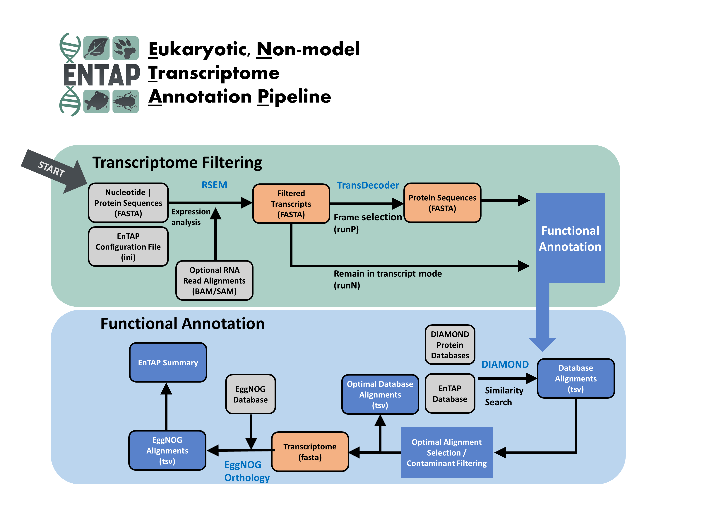

.. EnTAP documentation master file, created by
   sphinx-quickstart on Fri Jun 23 12:05:06 2017.
   You can adapt this file completely to your liking, but it should at least
   contain the root `toctree` directive.

   

   
Welcome to EnTAP's documentation!
=================================

EnTAP is an eukaryotic non-model annotation pipeline developed by Alexander Hart, Cynthia Webster, and Dr. Jill Wegrzyn of the Plant Computational Genomics Lab at the University of Connecticut with additional support from Dr. Stephen Ficklin and Josh Burns of Washington State University.

The version these docs relate to can be seen on the bottom left of the ReadTheDocs page. 

How to cite:
Hart AJ, Ginzburg S, Xu M, et al. EnTAP: Bringing faster and smarter functional annotation to non-model eukaryotic transcriptomes. Mol Ecol Resour. 2020;20:591–604. https://doi.org/10.1111/1755-0998.13106

.. toctree::
   :maxdepth: 1
   :caption: Getting Started
   :name: sec-started
   
   Getting_Started/introduction.rst
   Getting_Started/Installation/index.rst
   Getting_Started/ini_files.rst
   Getting_Started/Configuration/configuration.rst
   Getting_Started/Configuration/config_flags.rst
   Getting_Started/test_data.rst
   
.. toctree::
   :maxdepth: 1
   :caption: Running EnTAP
   :name: sec-running
   
   Running_EnTAP/execution_index.rst
   Running_EnTAP/execution_flags.rst
   Running_EnTAP/interpreting_the_results.rst
   Running_EnTAP/troubleshooting.rst
   
.. toctree::
   :maxdepth: 1
   :caption: Development
   :name: sec-dev
   
   Development/changelog.rst
   Development/future_features.rst

.. note:: Make sure you specify the version you are using in the bottom left before reading!
