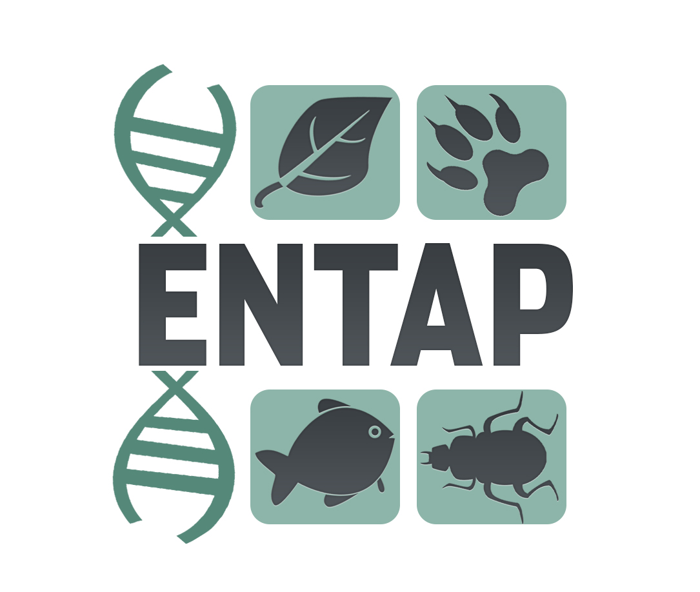

.. EnTAP documentation master file, created by
   sphinx-quickstart on Fri Jun 23 12:05:06 2017.
   You can adapt this file completely to your liking, but it should at least
   contain the root `toctree` directive.

   

   
Welcome to EnTAP's documentation!
=================================

EnTAP is an eukaryotic non-model annotation pipeline developed by Alexander Hart and Dr. Jill Wegrzyn of the Plant Computational Genomics Lab at the University of Connecticut.

.. toctree::
   :maxdepth: 1
   
   introduction.rst
   installation.rst
   basic_usage.rst
   interpreting_the_results.rst
   changelog.rst
   troubleshooting.rst
   future_features.rst

.. note:: Make sure you specify the version you are using in the bottom left before reading!