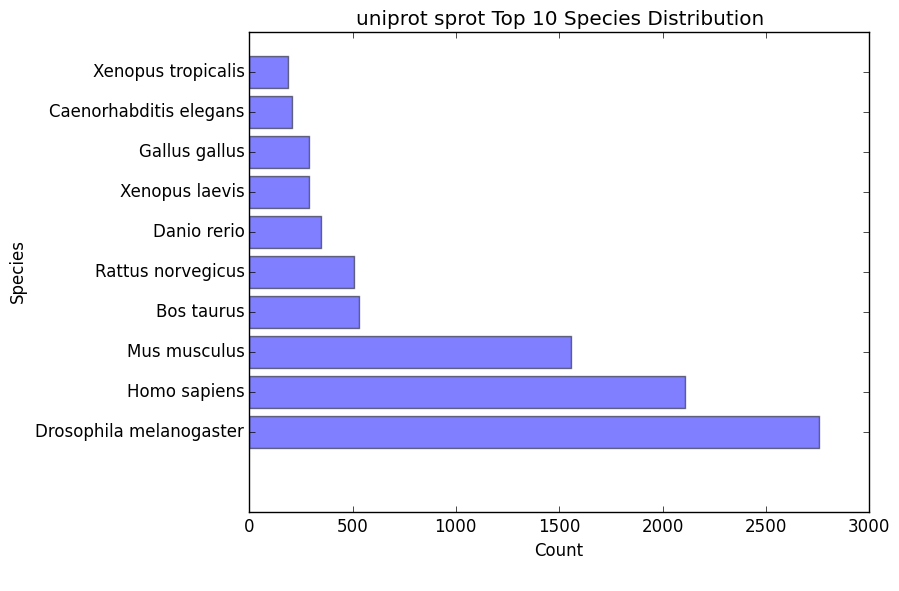
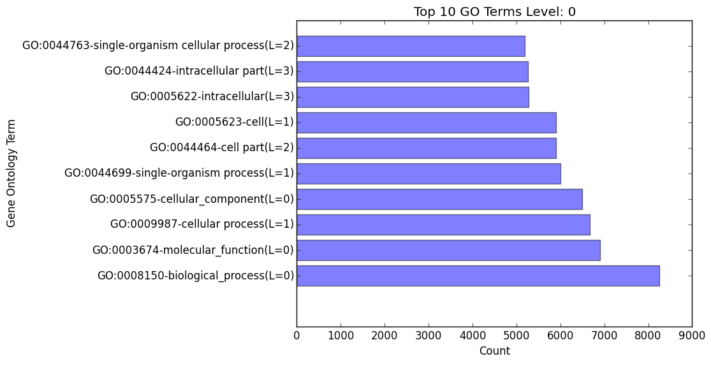
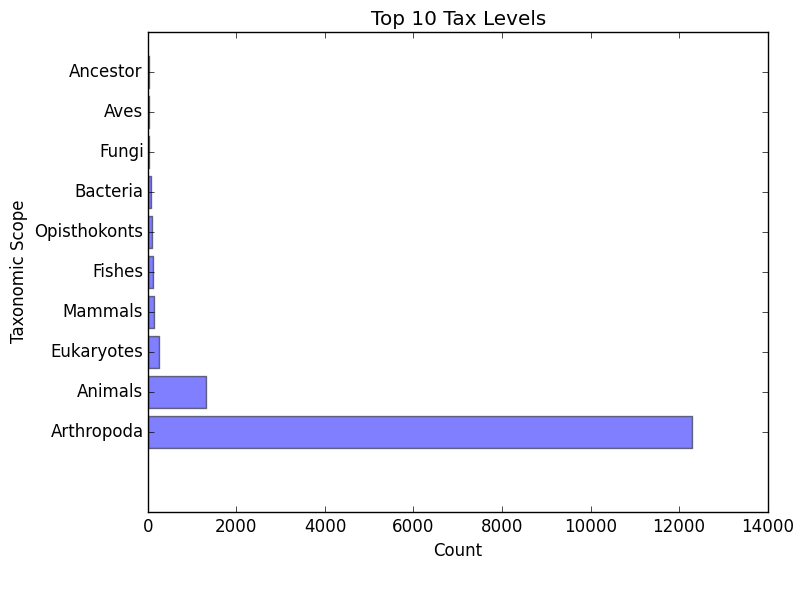

.. |exp_dir| replace:: */expression*
.. |exp_proc_dir| replace:: */processed*
.. |exp_fig_dir| replace:: */figures*
.. |frame_dir| replace:: */frame_selection*
.. |frame_proc_dir| replace:: */processed*
.. |frame_fig_dir| replace:: */figures*
.. |sim_dir| replace:: */similarity_search*
.. |sim_proc_dir| replace:: */processed*
.. |sim_fig_dir| replace:: */figures*
.. |sim_res_dir| replace:: */overall_results*
.. |egg_dir| replace:: */ontology/EggNOG*
.. |egg_fig_dir| replace:: */figures*
.. |egg_proc_dir| replace:: */processed*
.. |final_dir| replace:: */outfiles*
.. _EggNOG: https://github.com/jhcepas/eggnog-mapper
.. _DIAMOND: https://github.com/bbuchfink/diamond
.. _GeneMarkS-T: http://exon.gatech.edu/GeneMark/
.. _GO: http://www.geneontology.org/

Interpreting the Results
============

*EnTAP* provides many output files at each stage of execution to better see how the data is being managed throughout the pipeline:

#. :ref:`Expression Filtering<exp-label>`
#. :ref:`Frame Selection<frame-label>`
#. :ref:`Similarity Searching<sim-label>`
#. :ref:`Orthologous Groups/Ontology<ont-label>`
#. :ref:`Protein Families<inter-label>` (optional)
#. :ref:`Final Annotation Results<final-label>`

.. _exp-label:

Expression Filtering (RSEM)
----------------------------
The |exp_dir| folder will contain all of the relevant information for this stage of the pipeline. This folder will contain the :ref:`main files<exp_main-label>` (results from expression analysis software), files :ref:`processed<exp_proc-label>` from EnTAP (including graphs). 

.. exp_main-label:

RSEM Files: |exp_dir|
^^^^^^^^^^^^^^^^^^^^^^^
The |exp_dir| directory will contain all of the output from RSEM including a converted BAM file (if you input a SAM) and the results of the expression analysis. 

.. exp_proc-label:

EnTAP Files: |exp_proc_dir|
^^^^^^^^^^^^^^^^^^^^^^^^^^^^^
This directory will contain all of the files produced from EnTAP concerning expression analysis. With a generic transcriptome input of "Species.fasta", these files will have the following format

* Species_removed.fasta

    * Fasta file of sequences that were under the specified FPKM threshold

* Species_kept.fasta

    * Fasta file of sequences that were kept after filtering (over the FPKM threshold)

* |exp_fig_dir|

    * Directory containing a box plot of sequence length vs the sequences that were removed and kept after expression analysis

.. image::    plot_exp_box.png
	:scale: 50%
	:align: center

.. _frame-label:

Frame Selection (GeneMarkS-T)
------------------------------
The |frame_dir| folder will contain all of the relevant information for the frame selection stage of the pipeline. This folder will contain the :ref:`main files<f_main-label>` (results from frame selection software), files :ref:`processed<f_proc-label>` from EnTAP, and :ref:`figures<f_fig-label>` generated from EnTAP.

.. _f_main-label:

GeneMarkS-T Files: |frame_dir|
^^^^^^^^^^^^^^^^^^^^^^^^^^^^^^
The files within the root |frame_dir| directory contain the results from the frame selection portion of the pipeline. More information can be found at GeneMarkS-T_. With a generic transcriptome input of "Species.fasta", these files will have the following format:

* Species.fasta.fnn

    * Nucleotide fasta formatted frame selected sequences

* Species.fasta.faa

    * Amino acid fasta formatted frame selected sequences

* Species.fasta.lst

    * Information on each sequence (partial/internal/complete/ORF length)

* .err and .out file

    * These files are will contain any error or general information produced from the GeneMarkS-T run

.. _f_proc-label:

EnTAP Files: |frame_proc_dir|
^^^^^^^^^^^^^^^^^
Files within the |frame_proc_dir| are generated by EnTAP and will contain ORF information based on the GeneMarkS-T execution.

* complete_genes.fasta

    * Amino acid sequences of complete genes from transcriptome

* partial_genes.fasta

    * Amino acid sequences of partial (5' and 3') sequences

* internal_genes.fasta

    * Amino acid sequences of internal sequences

* sequences_lost.fasta

    * Nucleotide sequences in which a frame was not found. These will not continue to the next stages of the pipeline

.. _f_fig-label:

EnTAP Files: |frame_fig_dir|
^^^^^^^^^^^^^^^^^^^^^^^^^^^^
In addition to files, EnTAP will generate figures within the |frame_fig_dir| directory. These are some useful visualizations of the information provided by GeneMarkS-T

* frame_results_pie.png

    * Pie chart representing the transcriptome (post expression filtering) showing complete/internal/partial/and sequences in which a frame was not found

.. image::    plot_frame_pie.png
	:scale: 50%
	:align: center

* frame_selected_seq.png

    * Box plot of sequence length vs. the sequences that were lost during frame selection and the sequences in which a frame was found

.. image::    plot_frame_removed_box.png
	:scale: 50%
	:align: center

.. _sim-label:

Similarity Search (DIAMOND)
------------------------------
The |sim_dir| directory will contain all of the relevant information for the similarity searching stage of the pipeline. This folder will contain the :ref:`main files<sim_main-label>` (results from similarity search software), :ref:`files<sim_proc-label>` analyzing hits from each database, :ref:`overall<sim_res-label>` results combining the information from each database, and :ref:`figures<sim_fig-label>` generated from EnTAP.

.. _sim_main-label:

DIAMOND Files: |sim_dir|
^^^^^^^^^^^^^^^^^^^^^^^^^
The files within the |sim_dir| directory contain the results from the similarity searching portion of the pipeline against each database you select. More information can be found at DIAMOND_. With running _blastp (protein similarity searching), a generic transcriptome input of "Species.fasta", with a database called "database" the files will have the following format:

* blastp_Species_database.out

    * This contains the similarity search information provided in the format from DIAMOND
    * Header information (from left to right):

        * Query Sequence ID
        * Subject Sequence ID
        * Percentage of Identical Matches
        * Alignment Length
        * Number of Mismatches
        * Number of gap openings
        * Start of alignment in query
        * End of alignment in query
        * Start of alignment in subject
        * End of alignment in subject
        * Expect (e) value
        * Bit score
        * Query Coverage
        * Subject Title (pulled from database)
* blastp_Species_database_std.err and .out

    * These files are will contain any error or general information produced from DIAMOND

.. _sim_proc-label:

EnTAP Files: |sim_proc_dir|
^^^^^^^^^^^^^^^^^
Files within the |sim_proc_dir| are generated by EnTAP and will contain information based on the hits returned from similarity searching against each database. This information contains the *best hits* (discussed previously) from each database based on e-value, coverage, informativeness, phylogenetic closeness, and contaminant status.

The files below represent a run with the same parameters as the section above:

* All the TSV files mentioned in this section will have the same header as follows (from left to right):

    * Query sequence ID
    * Subject sequence ID
    * Percentage of identical matches
    * Alignment length
    * Number of mismatches
    * Number of gap openings
    * Start of alignment in query
    * End of alignment in query
    * Start of alignment in subject
    * End of alignment in subject
    * Expect (e) value
    * Query coverage
    * Subject title
    * Species (pulled from hit)
    * Origin Database
    * ORF (taken from frame selection stage)
    * Contaminant (yes/no the hit was flagged as a contaminant)

* database/best_hits.faa and .fnn and .tsv

    * Best hits (protein and nucleotide) that were selected from this database
    * This contains ALL best hits, including any contaminants that were found as well as uninformative hits
    * The .tsv file contains the header information mentioned above of these same sequences
    * Note: Protein or nucleotide information may not be available to report depending on your type of run (these files will be empty)

* database/best_hits_contam.faa/.fnn/.tsv

    * Contaminants (protein/nucleotide) separated from the best hits file. As such, these contaminants will also be in the _best_hits.faa/.fnn.tsv files

* database/best_hits_no_contam.faa/.fnn/.tsv

    * Sequences (protein/nucleotide) that were selected as best hits and not flagged as contaminants
    * With this in mind: best_hits = best_hits_no_contam + best_hits_contam
    * These sequences are separated from the rest for convenience if you would like to examine them differently

* database/no_hits.faa/.fnn/.tsv

    * Sequences (protein/nucleotide) from the transcriptome that did not hit against this particular database.
    * This does not include sequences that were lost during expression filtering or frame selection

* database/unselected.tsv

    * Similarity searching can result in several hits for each query sequence. With only one best hit being selected, the rest are unselected and end up here
    * Unselected hits can be due to a low e-value, coverage, or other properties EnTAP takes into account when selecting hits

.. _sim_res-label:

EnTAP Files: |sim_res_dir|
^^^^^^^^^^^^^^^^^^^^^^^^^^^^
While the |sim_proc_dir| directory contains the best hit information from each database, the |sim_res_dir| directory contains the overall best hits combining the hits from each database.

.. _sim_fig-label:

EnTAP Files: |sim_fig_dir|
^^^^^^^^^^^^^^^^^^^^^^^^^^^^
In addition to files, EnTAP will generate figures within the |sim_fig_dir| directory for each database. These are some useful visualizations of the information provided by similarity searching.

Here, there will be several figures:

* species_bar.png / species_bar.txt

    * Bar graph representing the top 10 species that were hit within a database
    * Text file representing the data being displayed

* contam_bar.png / contam_bar.txt

    * Bar graph representing the top 10 contaminants (within best hits) that were hit against the databast
    * Text file representing the data being displayed

.. image::    plot_sim_contam_bar.png
	:scale: 50%
	:align: center

.. _ont-label:

Orthologous Groups/Ontology (EggNOG)
----------------------------
The |egg_dir| directory will contain all of the relevant information for the EggNOG stage of the pipeline. This folder will contain the :ref:`EggNOG files<egg_main-label>`, :ref:`files<egg_proc-label>` analyzing the annotation from EggNOG, and :ref:`figures<egg_fig-label>` generated from EnTAP.

.. _egg_main-label:

EggNOG Files: |egg_dir|
^^^^^^^^^^^^^^^^^^^^^^^^^^^
Files within the |egg_dir| are generated by EggNOG and will contain information based on the hits returned from EggNOG against the orthologous databases. More information can be found at EggNOG_. 

* annotation_results.emapper.annotations

    * EggNOG results for sequences that previously hit against DIAMOND databases in similarity searching

* annotation_results_no_hits.emapper.annotations

    * EggNOG results for sequences that previously did NOT hit against DIAMOND databases in similarity searching

.. _egg_proc-label:

EnTAP Files: |egg_proc_dir|
^^^^^^^^^^^^^^^^^^^^^^^^^^^^^
Files within the |egg_proc_dir| are generated by EnTAP and contain information on what sequences were annotation and which were not. 

* unannotated_sequences.fnn/faa

    * Sequences where no gene family could be assigned (nucleotide/protein)

* annotated_sequences.fnn/faa

    * Sequences where a gene family could be assigned (nucleotide/protein)

.. _egg_fig-label:

EnTAP Files: |egg_fig_dir|
^^^^^^^^^^^^^^^^^^^^^^^^^^^^
The |egg_fig_dir| will contain figures generated by EnTAP of Gene Ontology and Taxonomic distribution of the results

* (overall/molecular_function/cellular_component/biological_process)#_go_bar_graph.png/.txt

    * Bar graph of each category of Gene Ontology terms of a specific level # (remember, level 0 signifies all levels!)

* eggnog_tax_scope.png/.txt

    * A bar graph representation of the taxonomic scope of the gene families assigned through EggNOG

.. _inter-label:

Protein Families (InterProScan)
----------------------------------
Full documentation coming soon!

.. _final-label:

Final Annotations
-----------------------

The final EnTAP annotations are contained within the |final_dir| directory. These files are the summation of each stage of the pipeline and contain the combined information. So these can be considered the most important files! 

All .tsv files in this section will have the following header information (from left to right)

    * Query sequence ID
    * Subject sequence ID
    * Percentage of identical matches
    * Alignment length
    * Number of mismatches
    * Number of gap openings
    * Start of alignment in query
    * End of alignment in query
    * Start of alignment in subject
    * End of alignment in subject
    * Expect (e) value
    * Query coverage
    * Subject title
    * Species (DIAMOND)
    * Origin Database (DIAMOND)
    * ORF (GeneMarkS-T)
    * Contaminant (yes/no the hit was flagged as a contaminant)
    * Seed ortholog (EggNOG)
    * Seed E-Value (EggNOG)
    * Seed Score (EggNOG)
    * Predicted Gene (EggNOG)
    * Taxonomic Scope (EggNOG, tax scope that was matched)
    * OGs (EggNOG, orthologous groups assigned)
    * Description (EggNOG)
    * KEGG Terms (EggNOG)
    * Protein Domains (EggNOG)
    * GO Biological (Gene Ontology normalized terms)
    * GO Cellular (Gene Ontology normalized terms)
    * GO Molecular (Gene Ontology normalized terms)
    * ----- Optional Columns If Using InterProScan -----
    * IPScan GO Biological (InterPro)
    * IPScan GO Cellular (InterPro)
    * IPScan GO Molecular (InterPro)
    * Pathways (InterPro)
    * InterPro (InterPro, database entry)
    * Protein Database (InterPro, database assigned. Ex: pfam)
    * Protein Description (InterPro, description of database entry)
    * E Value (InterPro, E-value of hit against protein database)

Gene ontology terms are normalized to levels based on the input flag from the user (or the default of 0,3,4). A level of 0 within the filename indicates that ALL GO terms will be printed to the annotation file. Normalization of GO terms to levels is generally done before enrichment analysis and is based upon the hierarchical setup of the Gene Ontology database. More information can be found at GO_. 

    * final_annotations_lvlX.tsv

        * As mentioned above, the 'X' represents the normalized GO terms for the annotation
        * This .tsv file will have the headers as mentioned previously as a summary of the entire pipeline

    * final_annotated.faa / .fnn

        * Nucleotide and protein fasta files containing all sequences that either hit databases through similarity searching or through the ontology stage

    * final_unannotated.aa / .fnn

        * Nucleotide and protein fasta files containing all sequences that did not hit either through similarity searching nor through the ontology stage